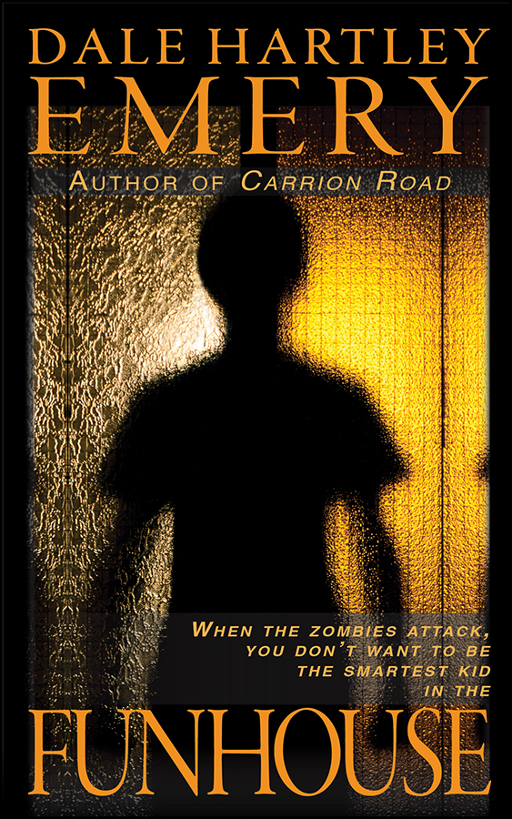

# [Dale Hartley Emery](http://dalehartleyemery.com)

Available now:
[Kindle](http://www.amazon.com/dp/B00JDZJ6L2/?tag=driscollbrookpress-20)
|
[Kobo](http://store.kobobooks.com/en-US/ebook/funhouse-10)
|
[Smashwords](https://www.smashwords.com/books/view/424764)

> Trapped in a funhouse in the sweltering Sacramento heat,
> Mark and his little brother Davy
> watch in horror as a zombie eats their friend.
> Now they must work together,
> one supplying the wits,
> the other supplying the blood,
> to find the doors to escape. 
> 
> But an even greater danger awaits,
> and the search for the door becomes a race for survival. 
> 
> A horrifying, heartwarming story
> about zombies and brotherly love
> from [Dale Hartley Emery](http://dalehartleyemery.com).

Paperback and additional ebook editions
coming soon
from Driscoll Brook Press.

